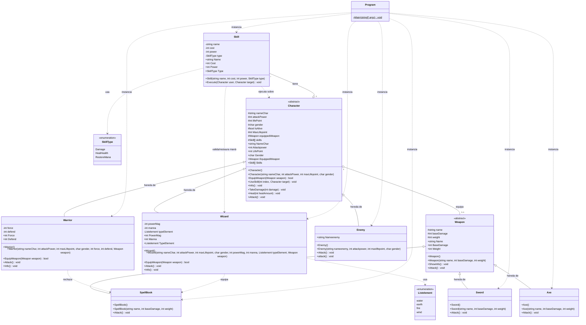

# Diagrama de Clases - Proyecto RPG

```mermaid
classDiagram
    direction TB

    %% Enumeraciones
    class Listelement {
        <<enumeration>>
        water
        earth
        fire
        wind
    }

    class SkillType {
        <<enumeration>>
        Damage
        HealHealth
        RestoreMana
    }

    %% Punto de entrada
    class Program {
        +Main(string[] args)$ void
    }

    %% Jerarquía de Personajes
    class Character {
        <<abstract>>
        #string nameChar
        #int attackPower
        #int lifePoint
        #char gender
        #bool IsAlive
        #int MaxLifepoint
        #Weapon equippedWeapon
        #Skill[] skills
        +string NameChar
        +int Attackpower
        +int LifePoint
        +char Gender
        +Weapon EquippedWeapon
        +Skill[] Skills
        +Character()
        +Character(string nameChar, int attackPower, int maxLifepoint, char gender)
        +EquipWeapon(Weapon weapon) bool
        +UseSkill(int index, Character target) void
        +Info() void
        +TakeDamage(int damage) void
        +Heal(int healAmount) void
        +Attack()* void
    }

    class Warrior {
        -int force
        -int defend
        +int Force
        +int Defend
        +Warrior()
        +Warrior(string nameChar, int attackPower, int maxLifepoint, char gender, int force, int defend, Weapon weapon)
        +EquipWeapon(Weapon weapon) bool
        +Attack() void
        +Info() void
    }

    class Wizard {
        -int powerMag
        -int manna
        -Listelement typeElement
        +int PowerMag
        +int Manna
        +Listelement TypeElement
        +Wizard()
        +Wizard(string nameChar, int attackPower, int maxLifepoint, char gender, int powerMag, int manna, Listelement typeElement, Weapon weapon)
        +EquipWeapon(Weapon weapon) bool
        +Attack() void
        +Info() void
    }

    class Enemy {
        +string Nameenemy
        +Enemy()
        +Enemy(string nameenemy, int attackpower, int maxlifepoint, char gender)
        +Attack() void
        +attack() void
    }

    %% Jerarquía de Armas
    class Weapon {
        <<abstract>>
        #string name
        #int baseDamage
        #int weight
        +string Name
        +int BaseDamage
        +int Weight
        +Weapon()
        +Weapon(string name, int baseDamage, int weight)
        +ShowInfo() void
        +Attack()* void
    }

    class Sword {
        +Sword()
        +Sword(string name, int baseDamage, int weight)
        +Attack() void
    }

    class Axe {
        +Axe()
        +Axe(string name, int baseDamage, int weight)
        +Attack() void
    }

    class SpellBook {
        +SpellBook()
        +SpellBook(string name, int baseDamage, int weight)
        +Attack() void
    }

    %% Sistema de Habilidades (Skills)
    class Skill {
        -string name
        -int cost
        -int power
        -SkillType type
        +string Name
        +int Cost
        +int Power
        +SkillType Type
        +Skill(string name, int cost, int power, SkillType type)
        +Execute(Character user, Character target) void
    }

    %% Relaciones de Herencia
    Character <|-- Warrior : hereda de
    Character <|-- Wizard : hereda de
    Character <|-- Enemy : hereda de
    Weapon <|-- Sword : hereda de
    Weapon <|-- Axe : hereda de
    Weapon <|-- SpellBook : hereda de

    %% Relaciones de Agregación, Asociación y Dependencia
    Character "1" o-- "*" Skill : tiene
    Character "1" o-- "0..1" Weapon : equipa
    Skill ..> SkillType : usa
    Skill ..> Character : ejecuta sobre
    Skill ..> Wizard : valida/restaura maná
    Warrior ..> SpellBook : rechaza
    Wizard ..> SpellBook : equipa
    Wizard ..> Listelement : usa
    Program ..> Warrior : instancia
    Program ..> Wizard : instancia
    Program ..> Enemy : instancia
    Program ..> Sword : instancia
    Program ..> Axe : instancia
    Program ..> SpellBook : instancia
    Program ..> Skill : instancia
```
